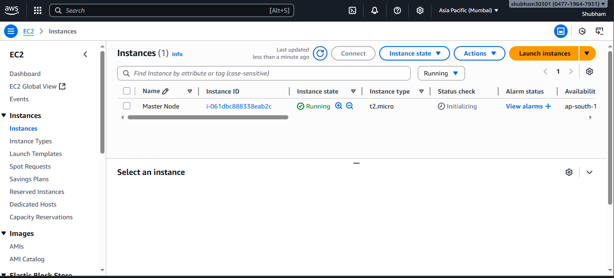
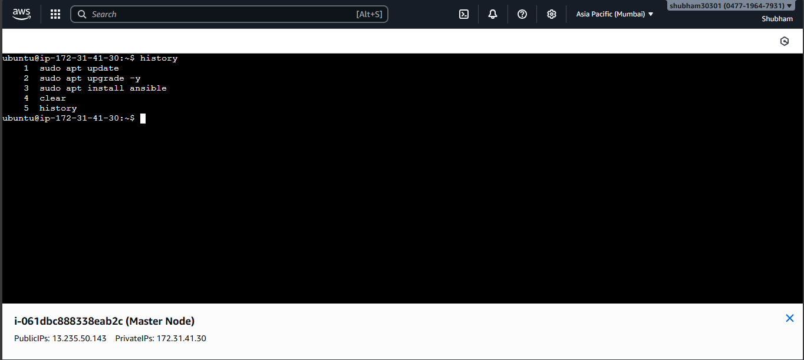
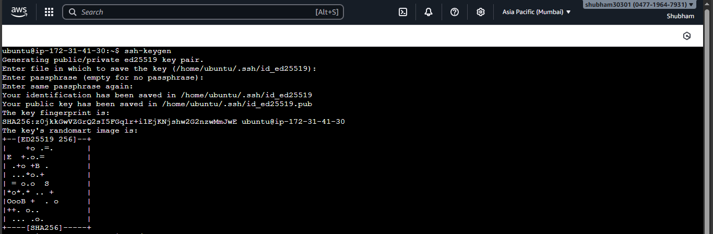
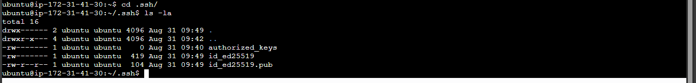
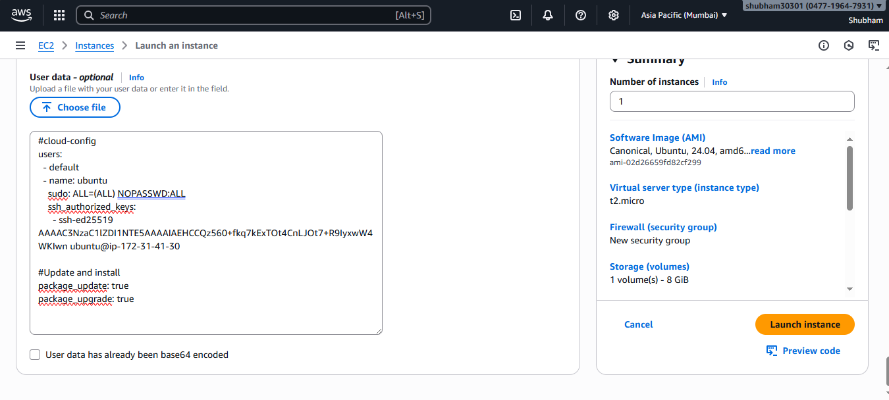

# About this Ansible_Project
Trying to make a basic automation via Ansible to retrive data from new VM's. Along with setup automation and connection with Node.

# Step 1
We need to have VM configured. In this project I am using AWS as it has free tier t2.micro Instances. First make a Instane which is going to be out master node (Ubuntu instances) and configure it. We will now SSH into the VM using Console connect or SSH via Public IP address. 



Once inside VM run the below command.

```bash
sudo apt update
sudo apt upgrade -y
sudo apt install ansible -y
```


# Step 2
The above command will install the important packages and also install Ansible. 
Once done run the below command.

```bash
ssh-keygen
```



This will generate key and keep clicking enter until files are created. You can make changes but default settings are ok. The command created 3 files id_ed25519, id_ed25519.pub and authorized_keys.
Now run the below command.

```bash
cd /.ssh
cat id_ed25519.pub
```
COPY the output we will need it in User_Data.yml


# Step 3

Create a Node VM and Copy the User_Data.yml in User Data of VM

```yml
#cloud-config
users:
  - default
  - name: ubuntu
    sudo: ALL=(ALL) NOPASSWD:ALL
    ssh_authorized_keys:
      - ssh-ed25519 AAAAC3NzaC1lZDI1NTE5AAAAIAEHCCQz560+fkq7kExTOt4CnLJOt7+R9IyxwW4WKIwn ubuntu@ip-172-31-41-30
  
#Update and install
package_update: true
package_upgrade: true
```


And Launch VM with this cloud_config

# Step 4

Go to master node and run the below command 

```bash
ansible all -i '172.31.38.106,' -u ubuntu -m ping
```

This will ping the node and let you know that connection was established.